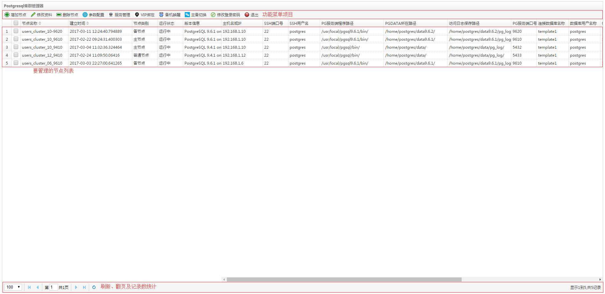
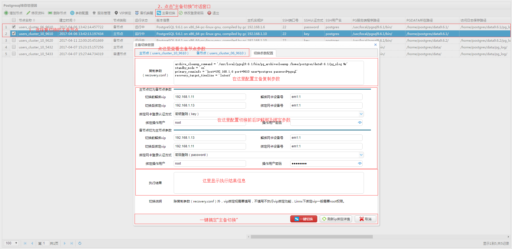

# pgclusteradmin

Pgclusteradmin是一款基于go开发的postgresql集群管理工具，当前主要功能有“节点资料集中管理”、“参数在线配置，参数文件多版本管理，参数文件模板管理”、“服务管理（即服务start,stop,restart,stop）”、“vip管理”、“备机唤醒”、“主备切换”；系统支持多用户，操作认证，支持SSH密码登陆和SSH公钥、私钥登陆；操作人员通过浏览器从远程登录进入管理平台，前面的界面使用easyui实现。

### 一、功能列表

* 节点资料增加，编辑，删除。
* 各个节点运行参数配置，参数文件多版本管理，参数文件模板管理。
* 单一节点服务start、stop、restart、reload及显示服务状态。
* 节点对应机器VIP绑定与解绑。
* 备机唤醒管理。
* 主备节点一键切换。

### 二、部署环境

* Ip：192.168.1.10
* os：centos 7.0 
* golang: go version go1.7.4 linux/amd64
* Postgresql：9.6.1 

### 三、Pgclusteradmin环境需求

#### 安装golang

* [root@ad ~]# yum install golang-1.7.4-1.el6.x86_64.rpm  
* [root@ad ~]# yum install golang-src-1.7.4-1.el6.noarch.rpm
* [root@ad ~]# yum install golang-bin-1.7.4-1.el6.x86_64.rpm

#### 安装postgresql 

* 使用postgresql主要是用于存储管理节点资料，操作员资料及操作日志

－－下载源码

    wget https://ftp.postgresql.org/pub/source/v9.6.1/postgresql-9.6.1.tar.gz

－－解压

    tar zxf postgresql-9.6.1.tar.gz

－－编译

    cd postgresql-9.6.1
    ./configure --prefix=/usr/local/pgsql9.6.1 --with-perl --with-tcl --with-python --with-openssl --with-pam --without-ldap --with-libxml --with-libxslt
    gmake 
    gmake install

－－初始化

    su postgres
    /usr/local/pgsql9.6.1/bin/initdb -D /home/postgres/data9.6.1 -E utf8 -U postgres -W

－－postgresql.conf配置

    listen_addresses = '*'
    log_destination = 'stderr'
    logging_collector = on

－－pg_hba.conf配置

    host    all             all             192.168.1.0/24          md5

配置完成后需要重启服务,其它参数视需要自己配置。

建立pgclusteradmin库并导入建立资料表。

    /usr/local/pgsql9.6.1/bin/psql -h 192.168.1.10 -U postgres -d postgres -p 5432 
    postgres=# create database pgcluster ENCODING 'utf8' template template0;
    \c pgcluster

－－导入下面数据表及数据

--节点资料表

    create table nodes
	(
	   id serial not null unique,
	   node_name text not null unique,    
	   createtime timestamp not null default now(),
	   host text not null,          
	   ssh_port integer not null,
	   ssh_user text not null,
	   ssh_password text not null,  
	   ssh_authmethod text not null default 'key',
	   pg_bin text not null,
	   pg_data text not null,
	   pg_log text not null default '',
	   pg_port integer not null,
	   pg_database text not null,
	   pg_user text not null,
	   pg_password text not null,
	   master_vip text,
	   master_vip_networkcard text,
	   slave_vip text,
	   slave_vip_networkcard text,
	   bind_vip_user text,
	   bind_vip_password text,  
	   bind_vip_authmethod text default 'key', 
	   remark text 
	);
	
	COMMENT ON TABLE nodes IS '节点资料表';
	COMMENT ON COLUMN nodes.id IS '系统编号';
	COMMENT ON COLUMN nodes.node_name IS '节点名称';   
	COMMENT ON COLUMN nodes.createtime IS '建立时间';   
	COMMENT ON COLUMN nodes.host IS '主机名或ip';   
	COMMENT ON COLUMN nodes.ssh_port IS 'ssh服务端口号';   
	COMMENT ON COLUMN nodes.ssh_user IS 'ssh用户';   
	COMMENT ON COLUMN nodes.ssh_password IS 'ssh密码';  
	COMMENT ON COLUMN nodes.ssh_authmethod IS '用户登录ssh服务认证方式，其值只能是key或者password';  
	COMMENT ON COLUMN nodes.pg_bin IS 'pg管理程序所在路径';    
	COMMENT ON COLUMN nodes.pg_data IS 'pgDATA所在路径';      
	COMMENT ON COLUMN nodes.pg_log IS '用户访问日志保存路径';      
	COMMENT ON COLUMN nodes.pg_port IS 'pg服务端口号';   
	COMMENT ON COLUMN nodes.pg_user IS 'pg用户';   
	COMMENT ON COLUMN nodes.pg_password IS 'pg密码';   
	COMMENT ON COLUMN nodes.master_vip IS '主节点时绑定VIP'; 
	COMMENT ON COLUMN nodes.master_vip_networkcard IS '主节点时绑定网卡设备号';                  
	COMMENT ON COLUMN nodes.slave_vip IS '备节点时绑定VIP';                  
	COMMENT ON COLUMN nodes.slave_vip_networkcard IS '备节点时绑定网卡设备号';                  
	COMMENT ON COLUMN nodes.bind_vip_user IS '绑定网卡操作用户';                  
	COMMENT ON COLUMN nodes.bind_vip_password IS '绑定网卡操作密码';    
	COMMENT ON COLUMN nodes.bind_vip_authmethod IS '绑定网卡操作用户登录ssh服务认证方式，其值只能是key或者password';      

--操作员资料表

    CREATE TABLE users
    (
        id serial not null unique,
        username text not null unique,
        password text not null
    );

    COMMENT ON TABLE users IS '操作员资料表';
    COMMENT ON COLUMN users.id IS '系统编号';
    COMMENT ON COLUMN users.username IS '登录账号';
    COMMENT ON COLUMN users.password IS '登录密码md5值';

--增加一个操作员记录表

    INSERT INTO users (username,password) values('admin',md5('admin'));

--操作日志表

    CREATE TABLE log
    (
        id serial not null unique,
        createtime timestamp not null default now(),
        remote_ip text,
        modlename text,
        username text,
        log_level text,
        remark text 
    );
    COMMENT ON TABLE log IS '日志表';
    COMMENT ON COLUMN log.id IS '系统编号';
    COMMENT ON COLUMN log.createtime IS '访问时间';
    COMMENT ON COLUMN log.remote_ip IS '访问客户端ip地址';
    COMMENT ON COLUMN log.username IS '用户名';  
    COMMENT ON COLUMN log.modlename IS '模块名称';
    COMMENT ON COLUMN log.log_level IS '日志级别';
    COMMENT ON COLUMN log.remark IS '日志内容';
	
--存储pg参数文件内容多个版本和公用模板

	CREATE TABLE parameter_bak_template
	(
	    id serial not null unique,
	    nodeid integer not null,
	    createtime timestamp not null default now(),
	    username text not null,
	    filename text not null,
	    version  text not null,
	    content  text not null,
	    category text not null,
	    remark   text not null
	);
	COMMENT ON TABLE parameter_bak_template IS '参数文件备份或者模板表';
	COMMENT ON COLUMN parameter_bak_template.id IS '系统编号';
	COMMENT ON COLUMN parameter_bak_template.nodeid IS '节点id号';
	COMMENT ON COLUMN parameter_bak_template.createtime IS '备份日期';
	COMMENT ON COLUMN parameter_bak_template.username IS '操作员账号';
	COMMENT ON COLUMN parameter_bak_template.filename IS '文件名称';
	COMMENT ON COLUMN parameter_bak_template.version IS '版本号';
	COMMENT ON COLUMN parameter_bak_template.content IS '内容';
	COMMENT ON COLUMN parameter_bak_template.category IS '类别，值为bak或者template';
	COMMENT ON COLUMN parameter_bak_template.remark IS '备注';

#### 下载pgclusteradmin所需要的go支持包

－－ssh支持包

    [root@ad ~]# cd /usr/lib/golang/src
    [root@ad src]# mkdir golang.org
    [root@ad src]# cd golang.org/
    [root@ad golang.org]# mkdir x
    [root@ad src]# cd x/
    [root@ad x]# git clone https://github.com/golang/crypto.git
    正克隆到 'crypto'...
    remote: Counting objects: 3256, done.
    remote: Total 3256 (delta 0), reused 0 (delta 0), pack-reused 3255
    接收对象中: 100% (3256/3256), 2.31 MiB | 958.00 KiB/s, done.
    处理 delta 中: 100% (2106/2106), done.

－－session支持包

    [root@ad x]# cd /usr/lib/golang/src
    [root@ad src]# mkdir github.com
    [root@ad src]# cd github.com
    [root@ad github.com]# mkdir astaxie
    [root@ad github.com]# cd astaxie/
    [root@ad astaxie]# git clone https://github.com/astaxie/session
    正克隆到 'session'...
    remote: Counting objects: 50, done.
    remote: Total 50 (delta 0), reused 0 (delta 0), pack-reused 50
    Unpacking objects: 100% (50/50), done.
    [root@ad astaxie]# ll
    总用量 8

－－postgresql操作支持包

    [root@ad astaxie]# cd /usr/lib/golang/src/github.com/
    [root@ad github.com]# mkdir jackc
    [root@ad github.com]# cd jackc
    [root@ad jackc]# git clone https://github.com/jackc/pgx
    正克隆到 'pgx'...
    remote: Counting objects: 3613, done.
    remote: Compressing objects: 100% (243/243), done.
    remote: Total 3613 (delta 157), reused 0 (delta 0), pack-reused 3370
    接收对象中: 100% (3613/3613), 1.24 MiB | 228.00 KiB/s, done.
    处理 delta 中: 100% (2481/2481), done.
    
### 四、pgclusteradmin部署配置和访问

#### 下载pgclusteradmin源码

    [root@ad pgclusteradmin]# cd /home/ad
    [root@ad ad]# git clone https://github.com/chenaisheng/pgclusteradmin
    正克隆到 'pgclusteradmin'...
    remote: Counting objects: 374, done.
    remote: Compressing objects: 100% (177/177), done.
    remote: Total 374 (delta 201), reused 348 (delta 185), pack-reused 0
    接收对象中: 100% (374/374), 284.09 KiB | 197.00 KiB/s, done.
    处理 delta 中: 100% (201/201), done.
    [root@ad ad]#
	
#### 配置连接数据库参数

	打开pgclusteradmin.go文件，拉下最后面，找到函数extractConfig()，代码如下所示

	/*
	功能描述：配置postgresql连接参数 
	            
	参数说明：无  
	
	返回值说明： 
	pgx.ConnConfig -- pg连接参数结构体
	*/
	
	func extractConfig() pgx.ConnConfig {
	
	    var config pgx.ConnConfig
	
	    config.Host = "192.168.1.10" //数据库主机host或ip
	    config.User = "postgres"     //连接用户
	    config.Password = "pgsql"    //用户密码
	    config.Database = "pgcluster" //连接数据库名
	    config.Port = 5432            //端口号
	    
	    return config       
	}  

	修改成上面部署postgresql的相应参数即可。
	
#### 配置数据库服务管理用户（os用户，一般使用postgres用户名）和os管理员（一般使用root用户名）远程ssh登录使用的私钥－－不使用私钥认证登录的话这一步可以忽略

		
	怎样配置使用SSH公钥、私钥登陆
	1、root用户登陆后，运行以下第一句指令，其他根据提示进行输入:
	
	ssh-keygen -t rsa    也可以使用DSA
	Generating public/private rsa key pair.
	Enter file in which to save the key (/root/.ssh/id_rsa):                 建议直接回车使用默认路径
	Created directory '/root/.ssh'
	Enter passphrase (empty for no passphrase):            输入密码短语（留空则直接回车）
	Enter same passphrase again:                                  重复密码短语
	Your identification has been saved in /root/.ssh/id_rsa.
	Your public key has been saved in /root/.ssh/id_rsa.pub.
	The key fingerprint is:
	05:71:53:92:96:ba:53:20:55:15:7e:5d:59:85:32:e4 root@test
	The key's randomart image is:
	+--[ RSA 2048]----+
	|   o o ..                |
	| . o oo.+ .            |
	| o.+... =               |
	| ...o                     |
	| o S                     |
	| .                         |
	|                           |
	|                           |
	|                           |
	+--------------------+
	
	此时在/root/.ssh/目录下生成了2个文件，id_rsa为私钥，id_rsa.pub为公钥。
	将公钥复制到需要登录电脑的/root/.ssh/authorized_keys文件中。
	好了，至此只要你保存好你的私钥，你的服务器相比原来使用root用户加密码登陆来说已经安全多了。
	
	2、数据库服务管理用户postgres的公钥、私钥生成方法与上面root用户的公钥、私钥生成方法一致，也可以root共用一对公钥、私钥。
	
	3、打开pgclusteradmin.go文件，拉下最后面，找到函数get_postgres_private_key()和get_root_private_key()，把数据库服务管理用户和管理员root使用的私钥复制上去

#### 运行pgclusteradmin

    [root@ad ad]# cd pgclusteradmin/
    [root@ad pgclusteradmin]# go run pgclusteradmin.go

#### 访问pgclusteradmin

    打开一个浏览器，输入 http://192.168.1.10:10001即可进入管理器，192.168.1.10换成你自己ip地址即可。

### 五、界面图 

#### 主界面说明    

#### 添加节点

#### 参数配置

#### 服务管理

#### VIP绑定

#### 备机唤醒

#### 主备切换

    
### 六、更新日志

#### 2017-4-12

* 1、所有涉及到ssh登录的接口或函数增加公钥、私钥登陆方法

#### 2017-4-4

* 1、增加参数配置多版本管理及参数模板文件管理

#### 2017-3-28

* 1、修复了ssh连接资源无法释放，造成内存泄漏的问题

#### 2017-3-23

* 1、修正了接口“parameter_saveHandler”变量modlename付值错误的bug

#### 2017-3-22

* 1、新增一个新的功能模块“备机唤醒”,支持一键唤醒并且绑定VIP。唤醒成功后系统会自动检查节点是否为“同步复制模式”和是否有“同步备机”连接上来，如果是“同步复制模式”并且没有“同步备机”连接上来，程序会主动把节点降级为“异步复制”模式。
* 2、重写了“服务管理”接口，解决了日志重定向后错误日志提取问题。
* 3、优化了部分接口，异步执行代码提高执行效率。

#### 2017-3-14

* 1、新增一个新的功能模块“参数配置”,支持一键保存reload或者一键保存restart,也可以只是保存当前配置。

#### 2017-3-13

* 1、新增一个新的功能模块“vip管理”,为了让主备节点切换时,应用程序更好的兼容,我们会给postgresql节点绑定一个对外服务的IP。

#### 2017-3-12

* 1、修改函数“getnode_type_and_status”的传入和信道返回为非地址传递。
* 2、修改函数“get_node_ip_bind_status”信道返回的数据为结构类型而非结构类型的序列化值,方便其它地方调用。
* 3、修改函数“master_slave_relation_check”的传入参数为非地址传递。

#### 2017-3-11

* 1、增加和编辑节时,限制“主机名+data路径”不能重复。
* 2、index.html做了操作提示优化。

#### 2017-3-9 
* 1、修改“ssh_run_chan”函数信道返回数据类型,使后面获取信道返回的数据处理起来更简便直接。
* 2、修改“promoteHandler”接口中bug,先前在主备切换后判断主备关系时传入master_slave_relation_check函数的变量倒颠了。

#### 2017-3-8

* 1、修改“getnoderowsHandler”接口,由原来的顺序获取列表中各个节点的运行状态修改为异步获取,大大的提高了列表接口返回效率。
    
#### 2017-3-7

* 1、修改“promoteHandler”接口,由原来的顺序执行修改为多次异步执行,使执行的速度提高一陪。
    
#### 2017-3-4

* 1、修正 项目中所有找不到ip命令和ifconfig命令的错误。

#### 2017-3-3

* 1、修正 “promote_get_ip_bind_statusHandler” 接口（获取主备节点ip绑定情况接口），变成异步同时获取主备节点的ip绑定详情，提高程序的响应速度。
* 2、修正 “insertnodeHandler” 接口（增加节点资料），提前执行rows.Close() 的错误。
* 3、修改 “insertnodeHandler”和“updatenodeHandler” 接口（修改节点资料），限制host+pg_port不能重复。
* 4、修正 index.html中前端删除节点资料后,在没刷新的情况下无法执行主备切换功能。
* 5、修正 index.html中前端主备切换判断主备节点类型不正确的bug。
* 6、修正 get_node_ip_bind_status接口中执行ip a命令ip找不到的错误 。  

### 联系我们      

                                                                        