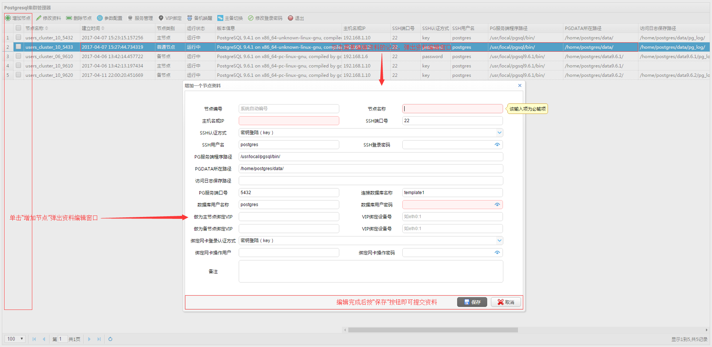
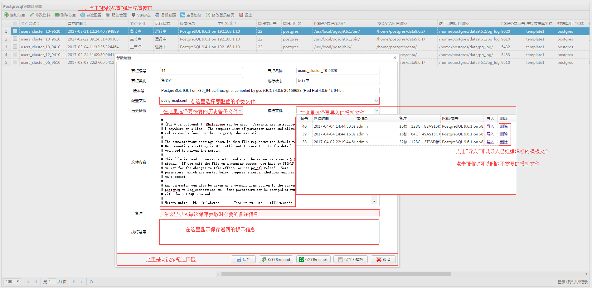
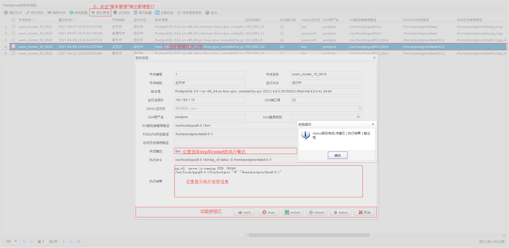
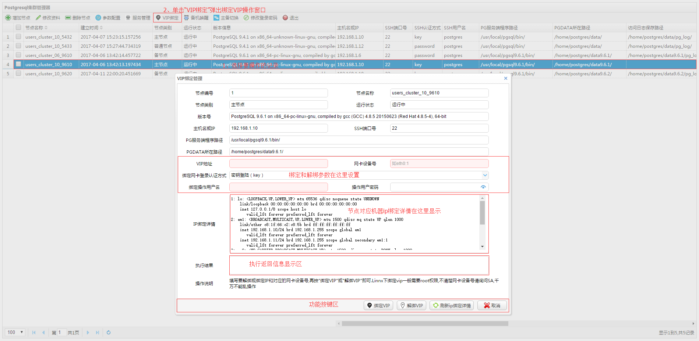
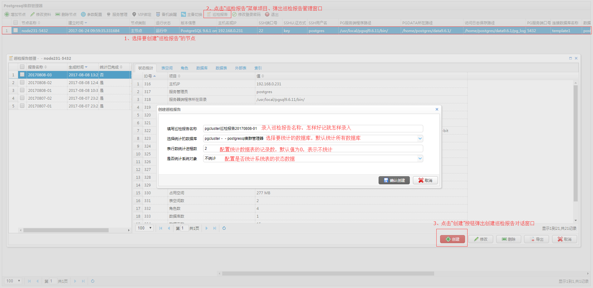
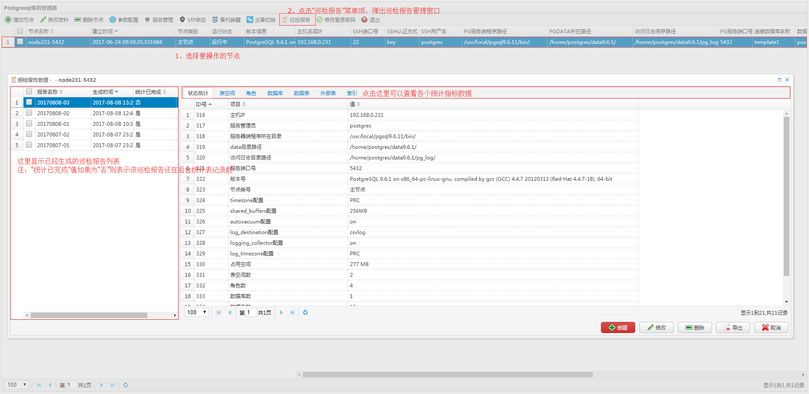
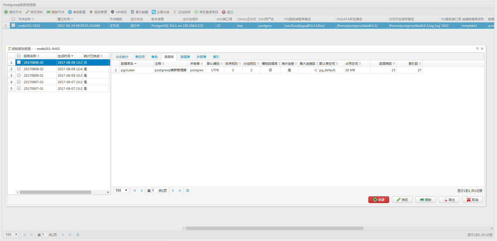
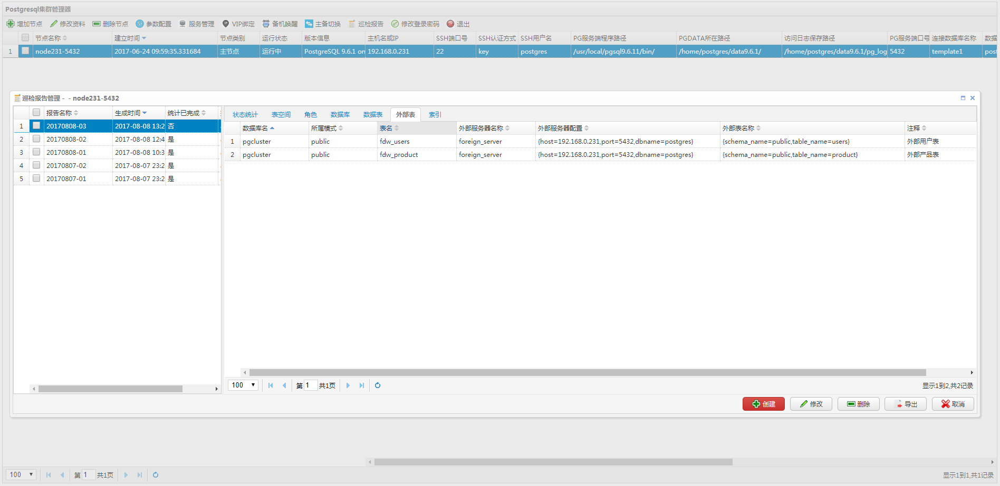
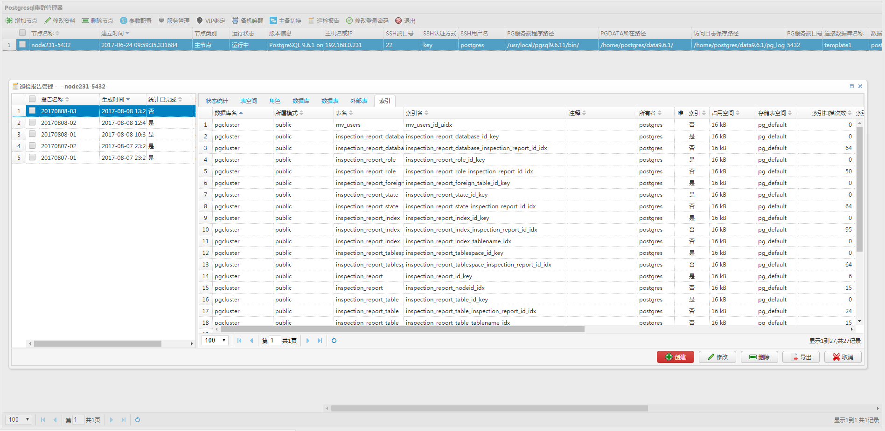

# pgclusteradmin

Pgclusteradmin是一款基于Go开发的PostgreSQL集群管理工具，当前主要功能有“节点资料集中管理”、“运行参数在线配置，参数文件多版本管理，参数文件模板管理”、“服务管理（即服务start,stop,restart,stop）”、“VIP绑定解绑”、“备机唤醒”、“主备切换”、“巡检报告”、“进程管理”、“表锁管理”、“查询统计”；系统支持多用户，操作认证，支持SSH密码登陆和SSH公钥、私钥登陆；操作人员通过浏览器从远程登录进入管理平台，前面的界面使用EasyUI实现。

### 一、功能列表

* 节点资料增加，编辑，删除。
* 各个节点运行参数配置，参数文件多版本管理，参数文件模板管理。
* 单一节点服务start、stop、restart、reload及显示服务状态。
* 节点对应机器VIP绑定与解绑。
* 备机唤醒管理。
* 主备节点一键切换。
* 巡检报告生成及导出。
* 管理工具－－进程管理
* 管理工具－－表锁管理
* 管理工具－－查询统计

### 二、部署环境

* Ip：192.168.0.231
* os：centos 6.9 
* golang: go version go1.8.3 linux/amd64
* Postgresql：9.6.1 

### 三、Pgclusteradmin环境需求

#### 源码安装golang

* [root@ad ~]# wget https://storage.googleapis.com/golang/go1.8.3.linux-amd64.tar.gz  
* [root@ad ~]# tar zxf go1.8.3.linux-amd64.tar.gz -C /usr/local

#### 配置golang环境变量

	[root@ad go]# vim /etc/profile
	
	GOROOT=/usr/local/go
	GOBIN=$GOROOT/bin
	PATH=$PATH:$GOBIN
	GOPATH=/home/go
	
	export GOROOT GOBIN GOPATH PATH
	
	保存退出
	[root@ad go]# source /etc/profile
	[root@nfs go]# go version
	go version go1.8.3 linux/amd64

#### 安装postgresql 

* 使用postgresql主要是用于存储管理节点资料，操作员资料及操作日志

－－下载源码

    wget https://ftp.postgresql.org/pub/source/v9.6.1/postgresql-9.6.1.tar.gz

－－解压

    tar zxf postgresql-9.6.1.tar.gz

－－编译

    cd postgresql-9.6.1
    ./configure --prefix=/usr/local/pgsql9.6.1 --with-perl --with-tcl --with-python --with-openssl --with-pam --without-ldap --with-libxml --with-libxslt
    gmake 
    gmake install

－－初始化

    su postgres
    /usr/local/pgsql9.6.1/bin/initdb -D /home/postgres/data9.6.1 -E utf8 -U postgres -W

－－postgresql.conf配置

    listen_addresses = '*'
    log_destination = 'csvlog'
    logging_collector = on

－－pg_hba.conf配置

    host    all             all             192.168.1.0/24          md5

配置完成后需要重启服务,其它参数视需要自己配置。

建立pgclusteradmin库并导入建立资料表。

    /usr/local/pgsql9.6.1/bin/psql -h 192.168.1.10 -U postgres -d postgres -p 5432 
    postgres=# create database pgcluster ENCODING 'utf8' template template0;
    \c pgcluster

－－导入源码包中的pgcluster.sql脚本

	\i pgcluster.sql
	

#### 下载pgclusteradmin所需要的go支持包

－－ssh支持包

    [root@ad ~]# cd /usr/local/go/src
    [root@ad src]# mkdir golang.org
    [root@ad src]# cd golang.org/
    [root@ad golang.org]# mkdir x
    [root@ad src]# cd x/
    [root@ad x]# git clone https://github.com/golang/crypto.git
    正克隆到 'crypto'...
    remote: Counting objects: 3256, done.
    remote: Total 3256 (delta 0), reused 0 (delta 0), pack-reused 3255
    接收对象中: 100% (3256/3256), 2.31 MiB | 958.00 KiB/s, done.
    处理 delta 中: 100% (2106/2106), done.

－－session支持包

    [root@ad x]# cd /usr/local/go/src
    [root@ad src]# mkdir github.com
    [root@ad src]# cd github.com
    [root@ad github.com]# mkdir astaxie
    [root@ad github.com]# cd astaxie/
    [root@ad astaxie]# git clone https://github.com/astaxie/session
    正克隆到 'session'...
    remote: Counting objects: 50, done.
    remote: Total 50 (delta 0), reused 0 (delta 0), pack-reused 50
    Unpacking objects: 100% (50/50), done.
    [root@ad astaxie]# ll
    总用量 8

－－postgresql操作支持包

	[root@ad pgclusteradmin]#  cd /usr/local/go/src/github.com/
	[root@ad github.com]# mkdir pkg
	[root@ad github.com]# cd pkg
	[root@ad pkg]# git clone https://github.com/pkg/errors
	Initialized empty Git repository in /usr/local/go1.8.3/src/github.com/pkg/errors/.git/
	remote: Counting objects: 418, done.
	remote: Total 418 (delta 0), reused 0 (delta 0), pack-reused 418
	Receiving objects: 100% (418/418), 86.42 KiB, done.
	Resolving deltas: 100% (253/253), done.
	[root@ad pkg]# 
	
    [root@ad pkg]# cd /usr/local/go/src/github.com/
    [root@ad github.com]# mkdir jackc
    [root@ad github.com]# cd jackc
    [root@ad jackc]# git clone https://github.com/jackc/pgx
    正克隆到 'pgx'...
    remote: Counting objects: 3613, done.
    remote: Compressing objects: 100% (243/243), done.
    remote: Total 3613 (delta 157), reused 0 (delta 0), pack-reused 3370
    接收对象中: 100% (3613/3613), 1.24 MiB | 228.00 KiB/s, done.
    处理 delta 中: 100% (2481/2481), done.
	
－－golang excel驱动包

	[root@ad github.com]# cd /usr/local/go/src/github.com/
	[root@ad github.com]# mkdir tealeg
	[root@ad github.com]# cd tealeg/
	[root@ad tealeg]# git clone https://github.com/tealeg/xlsx
	正克隆到 'xlsx'...
	remote: Counting objects: 2793, done.
	remote: Total 2793 (delta 0), reused 0 (delta 0), pack-reused 2792
	接收对象中: 100% (2793/2793), 1.11 MiB | 357.00 KiB/s, done.
	处理 delta 中: 100% (1503/1503), done.
    
### 四、pgclusteradmin部署配置和访问

#### 下载pgclusteradmin源码

    [root@ad pgclusteradmin]# cd /home/ad
    [root@ad ad]# git clone https://github.com/chenaisheng/pgclusteradmin
    正克隆到 'pgclusteradmin'...
    remote: Counting objects: 374, done.
    remote: Compressing objects: 100% (177/177), done.
    remote: Total 374 (delta 201), reused 348 (delta 185), pack-reused 0
    接收对象中: 100% (374/374), 284.09 KiB | 197.00 KiB/s, done.
    处理 delta 中: 100% (201/201), done.
    [root@ad ad]#
	
#### 配置连接数据库参数

	打开pgclusteradmin.go文件，拉下最后面，找到函数extractConfig()，代码如下所示

	/*
	功能描述：配置postgresql连接参数 
	            
	参数说明：无  
	
	返回值说明： 
	pgx.ConnConfig -- pg连接参数结构体
	*/
	
	func extractConfig() pgx.ConnConfig {
	
	    var config pgx.ConnConfig
	
	    config.Host = "127.0.0.1" //数据库主机host或ip
	    config.User = "postgres"     //连接用户
	    config.Password = "pgsql"    //用户密码
	    config.Database = "pgcluster" //连接数据库名
	    config.Port = 5432            //端口号
	    
	    return config       
	}  

	修改成上面部署postgresql的相应参数即可。
	
#### 配置数据库服务管理用户（os用户，一般使用postgres用户名）和os管理员（一般使用root用户名）远程ssh登录使用的私钥－－不使用私钥认证登录的话这一步可以忽略

		
	怎样配置使用SSH公钥、私钥登陆
	1、root用户登陆后，运行以下第一句指令，其他根据提示进行输入:
	
	ssh-keygen -t rsa    也可以使用DSA
	Generating public/private rsa key pair.
	Enter file in which to save the key (/root/.ssh/id_rsa):                 建议直接回车使用默认路径
	Created directory '/root/.ssh'
	Enter passphrase (empty for no passphrase):            输入密码短语（留空则直接回车）
	Enter same passphrase again:                                  重复密码短语
	Your identification has been saved in /root/.ssh/id_rsa.
	Your public key has been saved in /root/.ssh/id_rsa.pub.
	The key fingerprint is:
	05:71:53:92:96:ba:53:20:55:15:7e:5d:59:85:32:e4 root@test
	The key's randomart image is:
	+--[ RSA 2048]----+
	|   o o ..                |
	| . o oo.+ .            |
	| o.+... =               |
	| ...o                     |
	| o S                     |
	| .                         |
	|                           |
	|                           |
	|                           |
	+--------------------+
	
	此时在/root/.ssh/目录下生成了2个文件，id_rsa为私钥，id_rsa.pub为公钥。
	将公钥复制到需要登录电脑的/root/.ssh/authorized_keys文件中。
	好了，至此只要你保存好你的私钥，你的服务器相比原来使用root用户加密码登陆来说已经安全多了。
	
	2、数据库服务管理用户postgres的公钥、私钥生成方法与上面root用户的公钥、私钥生成方法一致，也可以root共用一对公钥、私钥。
	
	3、打开pgclusteradmin.go文件，拉下最后面，找到函数get_postgres_private_key()和get_root_private_key()，把数据库服务管理用户和管理员root使用的私钥复制上去

#### 运行pgclusteradmin

    [root@ad ad]# cd pgclusteradmin/
    [root@ad pgclusteradmin]# go run pgclusteradmin.go

#### 访问pgclusteradmin

    打开一个浏览器，输入 http://192.168.0.231:10001即可进入管理器，192.168.0.231换成你自己ip地址即可。初始化的用户名和密码都是"admin"
	
#### 注册pgclusteradmin做为一个服务（线上部署使用，测试的话可以漂过）

	1、编译pgclusteradmin.go程序为可执行程序
	[root@ad pgclusteradmin]# go build pgclusteradmin.go
	
	2、复制pgclusteradmin程序及easyui目录至/usr/local/pgclusteradmin目录下
	[root@ad pgclusteradmin]# mkdir /usr/local/pgclusteradmin
	[root@ad pgclusteradmin]# cp pgclusteradmin easyui/ /usr/local/pgclusteradmin -rf
		
	3、复制服务管理脚本至目录至/etc/init.d目录下
	[root@ad pgclusteradmin]# cp ./etc/init.d/pgclusteradmin /etc/init.d/pgclusteradmin 
	[root@ad pgclusteradmin]# chmod +x /etc/init.d/pgclusteradmin 
	
	4、配置pgclusteradmin为服务
	[root@ad pgclusteradmin]# chkconfig --add pgclusteradmin 
	[root@ad pgclusteradmin]# chkconfig --list | grep pgclusteradmin 
	pgclusteradmin  0:关闭  1:关闭  2:启用  3:启用  4:启用  5:启用  6:关闭
	
	5、测试pgclusteradmin服务使用
	[root@ad pgclusteradmin]# service pgclusteradmin start
	Starting pgclusteradmin
	[root@ad pgclusteradmin]# service pgclusteradmin status
	pgclusteradmin (pid 15686) already running..
	[root@ad pgclusteradmin]# service pgclusteradmin restart
	Stoping pgclusteradmin 
	Starting pgclusteradmin
	[root@nfs pgclusteradmin]# service pgclusteradmin status 
	pgclusteradmin (pid 15717) already running..
	[root@ad pgclusteradmin]# service pgclusteradmin help
	Usage: /etc/init.d/pgclusteradmin {start|stop|status|restart|help}
	            start  - start pgclusteradmin
	            stop  - stop pgclusteradmin
	            status  - show current status of pgclusteradmin
	            restart  - restart pgclusteradmin if running by sending a SIGHUP or start if not running
	            help  - this screen 
	[root@ad pgclusteradmin]# 
		

### 五、界面图 

#### 主界面说明    

#### 添加节点

#### 参数配置

#### 服务管理

#### VIP绑定

#### 备机唤醒

#### 主备切换

#### 巡检报告create

#### 巡检报告state

#### 巡检报告tablespace

#### 巡检报告role

#### 巡检报告database

#### 巡检报告table

#### 巡检报告foreign table

#### 巡检报告index

#### 管理工具－－进程管理

#### 管理工具－－表锁管理

#### 管理工具－－查询统计

    
### 六、更新日志

#### 2017-8-16

* 1、编写pgclusteradmin服务管理脚本，存放于源码包etc/init.d目录下,名称为pgclusteradmin,是一个shell脚本。
* 2、增加管理工具－－进程管理，用于管理postgresql用户连接进程，支持在线“取消查询”和“杀死进程”。
* 3、增加管理工具－－表锁管理，用于管理postgresql各种受阻塞锁监控管理，支持在线“取消查询”和“杀死进程”，感谢“德哥”提供了9.5之前pg锁的监控方法。
* 4、增加管理工具－－查询统计，用于对pg_stat_statements数据进行可视化统计，需要pg_stat_statements模块支持。
* 5、工具使用文档重新整理，增加文档结构，方便大家使用。

#### 2017-8-8

* 1、巡检报告增加“外部表”统计指标。
* 2、巡检报告“表数据”增加“记录数估值（reltuples）”,“记录偏差”count记录数－reltuples，占用盘页估值（relpages），每行占用存储空间，pg_table_size()/count记录数或者reltuples。
* 3、原来的“表数据”统计项目中合并“物化视图”这个对象的统计。
* 4、导出巡检报表也做了相应的调整。
* 5、修正inspection_report_table_rownum_update_run函数中不同库，同模式，同表名统计记录数的bug。
* 6、修正inspection_report_state_make函数中统计节点占用空间时null值存入出错问题。

#### 2017-6-19

* 1、修正函数ssh_connect中ssh时ssh: must specify HostKeyCallback报错问题。
* 2、修正str_is_ip函数ip地址判断BUG。
* 3、修正get_node_ip_bind_status函数在一些centos下执行存在的问题解决办法。

#### 2017-5-23

* 1、优化“巡检报告”生成方式，增加统计数据库过虑，是否统计系统对象过虑，表行数统计最大进程数限制，解决统计表记录数时系统负载过高的问题。统计表记录数变更成异步统计，所以现在提示生成报告成功后，表记录数有可能还没统计完成，特别是大表的统计比较占用时间。只有当你看到巡检报告列表中的“统计已完成”值为“是”，这时所有统计工作才完成。

#### 2017-5-05

* 1、增加了“巡检报告”主模块。

#### 2017-4-16

* 1、修改接口“getnode_type_and_status”存在的一个bug。

#### 2017-4-12

* 1、所有涉及到ssh登录的接口或函数增加公钥、私钥认证方法。

#### 2017-4-4

* 1、增加参数配置多版本管理及参数模板文件管理。

#### 2017-3-28

* 1、修复了ssh连接资源无法释放，造成内存泄漏的问题。

#### 2017-3-23

* 1、修正了接口“parameter_saveHandler”变量modlename付值错误的bug。

#### 2017-3-22

* 1、新增一个新的功能模块“备机唤醒”,支持一键唤醒并且绑定VIP。唤醒成功后系统会自动检查节点是否为“同步复制模式”和是否有“同步备机”连接上来，如果是“同步复制模式”并且没有“同步备机”连接上来，程序会主动把节点降级为“异步复制”模式。
* 2、重写了“服务管理”接口，解决了日志重定向后错误日志提取问题。
* 3、优化了部分接口，异步执行代码提高执行效率。

#### 2017-3-14

* 1、新增一个新的功能模块“参数配置”,支持一键保存reload或者一键保存restart,也可以只是保存当前配置。

#### 2017-3-13

* 1、新增一个新的功能模块“vip管理”,为了让主备节点切换时,应用程序更好的兼容,我们会给postgresql节点绑定一个对外服务的IP。

#### 2017-3-12

* 1、修改函数“getnode_type_and_status”的传入和信道返回为非地址传递。
* 2、修改函数“get_node_ip_bind_status”信道返回的数据为结构类型而非结构类型的序列化值,方便其它地方调用。
* 3、修改函数“master_slave_relation_check”的传入参数为非地址传递。

#### 2017-3-11

* 1、增加和编辑节时,限制“主机名+data路径”不能重复。
* 2、index.html做了操作提示优化。

#### 2017-3-9 
* 1、修改“ssh_run_chan”函数信道返回数据类型,使后面获取信道返回的数据处理起来更简便直接。
* 2、修改“promoteHandler”接口中bug,先前在主备切换后判断主备关系时传入master_slave_relation_check函数的变量倒颠了。

#### 2017-3-8

* 1、修改“getnoderowsHandler”接口,由原来的顺序获取列表中各个节点的运行状态修改为异步获取,大大的提高了列表接口返回效率。
    
#### 2017-3-7

* 1、修改“promoteHandler”接口,由原来的顺序执行修改为多次异步执行,使执行的速度提高一陪。
    
#### 2017-3-4

* 1、修正 项目中所有找不到ip命令和ifconfig命令的错误。

#### 2017-3-3

* 1、修正 “promote_get_ip_bind_statusHandler” 接口（获取主备节点ip绑定情况接口），变成异步同时获取主备节点的ip绑定详情，提高程序的响应速度。
* 2、修正 “insertnodeHandler” 接口（增加节点资料），提前执行rows.Close() 的错误。
* 3、修改 “insertnodeHandler”和“updatenodeHandler” 接口（修改节点资料），限制host+pg_port不能重复。
* 4、修正 index.html中前端删除节点资料后,在没刷新的情况下无法执行主备切换功能。
* 5、修正 index.html中前端主备切换判断主备节点类型不正确的bug。
* 6、修正 get_node_ip_bind_status接口中执行ip a命令ip找不到的错误 。  

### 接下来开发计划

* 1、调整前后端代码，各个模块解耦独立出来，方便后期多人工作协同

### 联系我们      

                                                                        